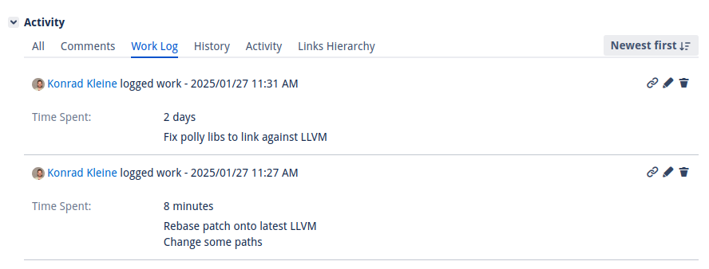

README
======

This command line tool let's you log the time that you've spent on one or more
JIRA issues without the need to click through the JIRA web interface. We allow
you to log the time either automatically (with a timer) or manually (by entering
how much time you've spent in words, e.g. `1h`, `30m`).

Installation
------------

Install `jira-worklogger` from pip using this command:

```console
$ python -m pip install jira-worklogger
```

Demo
----

First time setup and automatic time logging
-------------------------------------------

This demonstration shows how `jira-worklogger` is set up for the first time and
then used to track the time you spent on a JIRA issue automatically. For this,
select at least one issue from your open issues list and start the timer. Leave the
terminal open and start working on your issue. A spinner will show that the timer is
running. When you're done with your work, come back and press Enter in the
terminal to stop the timer, then log the time in JIRA together with an optional
comment.


Manual time logging
-------------------

The following demo shows how you can show your issues from a pre-configure JIRA
Server and select one to track the time manually. This is done by giving a
duration like `1h` for one hour or `20m` for twenty minutes.


Advanced usage and "did"
------------------------

The following demo shows how to work on multiple issues with different tracking methods
as well as how to show your work log using the [did](https://github.com/psss/did) tool.
NOTE: At the time of writing this [my pr](https://github.com/psss/did/pull/429) was not
yet merged into did.


Result in JIRA
--------------

In JIRA the result from the two time logs will look like this:



Usage
-----

### Jira Cloud API token

When configuring a Jira Cloud site choose the "Jira Cloud - Email and API token"
authentication option. You will be asked for your Atlassian account email address
and an API token. Create or manage API tokens at
<https://id.atlassian.com/manage-profile/security/api-tokens>.

### Personal access token (PAT)

For Jira Server and Data Center instances choose the "Jira Server / Data Center -
Personal Access Token" option. To acquire a personal access token you have to go to
`https://<YOUR_JIRA_SERVER>/secure/ViewProfile.jspa?selectedTab=com.atlassian.pats.pats-plugin:jira-user-personal-access-tokens`.

For the Red Hat issues, that is [here](https://issues.redhat.com/secure/ViewProfile.jspa?selectedTab=com.atlassian.pats.pats-plugin:jira-user-personal-access-tokens).

> **Security note:** The credentials you enter during setup are written to
> `~/.config/jira-worklogger/jira-worklogger.conf` in plain text.

### Controlling which issues appear

When you reach the issue picker, the CLI first asks **how** you want to find
issues. The built-in views currently include:

- `My assigned issues` – uses the per-server `issue_jql` (defaults to
  `assignee=currentUser() AND statusCategory not in (Done)`).
- `Shared/team buckets` – available when `team_issue_jql` is configured for the
  server.
- `All project tickets` – available when the server lists project keys via
  `project_keys = ABC, XYZ`. The CLI expands this to
  `project in (ABC, XYZ) AND statusCategory not in (Done)`.
- `Search Jira by keywords` and `Search Jira with custom JQL` – ad‑hoc searches
  that add more issues to the current selection round.
- `Enter issue key manually` – quick entry for a known key.
- `Review current selection` – remove previously chosen issues before logging
  time.
- Within any issue list, choose **Back to view selector** (shortcut `b`) to
  return without changing your current selection.
- While Jira searches are running you’ll see a spinner indicating that tickets
  are being loaded.

After each successful selection, the CLI asks whether you want to **Log time now**
or keep browsing. Pick the new option to jump straight into either the timer or
manual entry flow without revisiting the view selector.

You can configure these views during server setup or later by editing the
section inside `~/.config/jira-worklogger/jira-worklogger.conf`:

```
[my-server]
url = https://example.atlassian.net
auth_type = cloud_token
issue_jql = assignee = currentUser() AND statusCategory not in (Done)
team_issue_jql = project = MEET AND type = Task
project_keys = PROJ, OPS, MEET
```

Leave `team_issue_jql` and `project_keys` blank if you don’t need those views.

### Run from source

Clone the code.

```console
$ git clone https://github.com/kwk/jira-worklogger
$ cd jira-worklogger
```

Install dependencies and set up virtual environment.

```console
$ poetry install
Installing dependencies from lock file

No dependencies to install or update

Installing the current project: jira-worklogger (0.1.0)
```

Run the `jira-worklogger` CLI tool using poetry.

```console
$ poetry run jira-worklogger
? Please select a server to work with (Use arrow keys)
 » Red Hat - https://issues.redhat.com
   ---------------
   Add a new server
```

Build Documentation
===================

To build the documentation, you need the
[`agg`](https://github.com/asciinema/agg) executable in your path.
[`asciinema`](https://github.com/asciinema/asciinema) is needed if you want to
record your own screencaptures.
